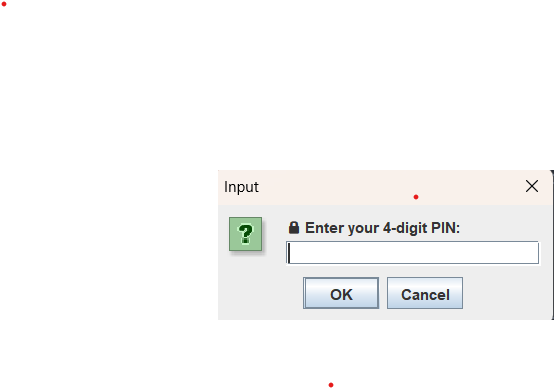
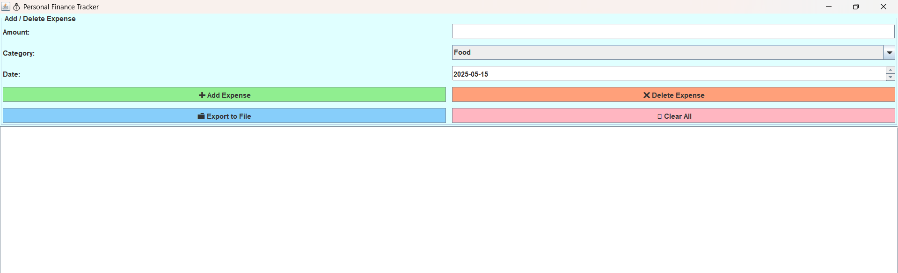
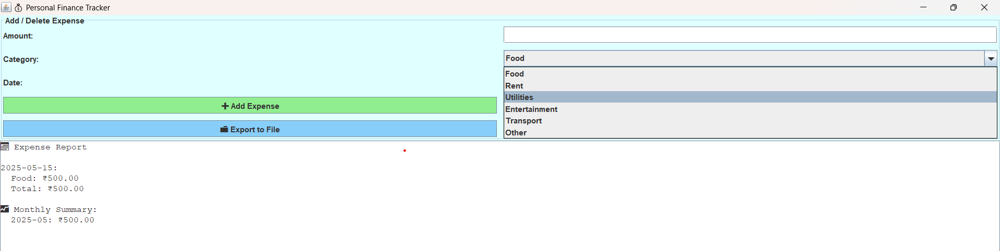

This is a finance tracker -which helps you in tracking your expenses 

Programming Lang-Java,GUI

# 💰 PersonalFinanceTracker-JavaSwing – Desktop Expense Management App

**PersonalFinanceTracker** is a lightweight, intuitive Java Swing application designed to help you track your daily and monthly expenses by category. Secure your financial data with a PIN, easily add/delete expenses, and export reports to keep your budgeting on point.

---

## ✨ Features

- 🔒 **PIN Authentication**: Secure access with a 4-digit PIN lock  
- ➕ **Add/Delete Expenses**: Manage expenses by date and category  
- 📅 **Daily & Monthly Summaries**: View expenses grouped by day and month  
- 📁 **Export Reports**: Save your expense summary to a text file  
- 🎨 **Clean GUI**: Colorful, easy-to-use interface built with Java Swing  

---

## 🚀 Getting Started

### Prerequisites

- Java JDK 8 or above  
- A Java IDE (like IntelliJ, Eclipse) or command-line tools  

### Installation & Running

1. Clone or download this repository:

   ```bash
   git clone https://github.com/yourusername/PersonalFinanceTracker-JavaSwing.git
   cd PersonalFinanceTracker-JavaSwing

## Compile the Java files:

**javac FinanceTracker.java Pincode.java**
Run the application:

**java Pincode**
Enter the PIN 1234 to start tracking your expenses.


---


## 📸 Screenshots

1. PIN Authentication Prompt  
Insert screenshot here:  


2. Main Expense Tracker Interface  
Insert screenshot here:  


3. Expense Report and Export Option  
Insert screenshot here:  



---

## 🛠️ Technologies Used

- Java Swing for GUI  
- Java Collections Framework for data management  
- SimpleDateFormat for date handling  
- FileWriter for exporting reports  

---

## 🙏 Acknowledgements

- Inspired by personal finance tracking needs  
- Java Swing tutorials and official documentation  

---

## 📝 License

This project is licensed under the MIT License.

